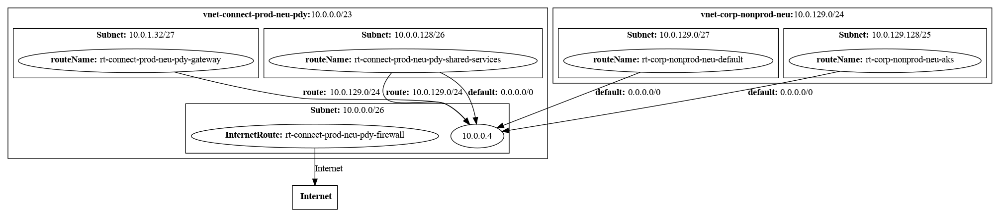

= Azure Route Table Visualizer

Simple commandline tool to visualize Azure Route Tables.
Query Azure Resource Graph for Route Tables and Virtual Networks and create a dot file for graphviz.

== Usage

Open https://resources.azure.com/[azure resource explorer]
And execute the following query

[, kusto]
----
Resources
| join kind=leftouter
( ResourceContainers
| where type=='microsoft.resources/subscriptions'
| project VNetSubsciptionName=name, subscriptionId
) on subscriptionId
| where type == 'microsoft.network/routetables'
| extend RoutingTableAssignedSubnet = properties.subnets
| mv-expand RoutingTableAssignedSubnet
| extend RoutingTableAssignedSubnetId = tostring(RoutingTableAssignedSubnet.id)
| extend routes = properties.routes
| mv-expand routes
| extend routeAddressPrefix = routes.properties.addressPrefix
| extend routeNextHopIpAddress = routes.properties.nextHopIpAddress
| extend routeNextHopType = routes.properties.nextHopType
| extend routeId = id
| extend routeName = name
| join kind=leftouter
(
Resources
| where type == 'microsoft.network/virtualnetworks'
| extend VNetRange = properties.addressSpace.addressPrefixes
| mv-expand VNetRange
| extend Subnet = properties.subnets
| mv-expand Subnet
| extend SubnetRange = Subnet.properties.addressPrefix
| extend SubnetId = tostring(Subnet.id)
| extend VNetId=id
| extend VNetSubscriptionId=subscriptionId
| project VNetId,VNetName=name,VNetRange,SubnetRange,SubnetId
) on $left.RoutingTableAssignedSubnetId == $right.SubnetId
| project VNetName,VNetRange,SubnetRange,routeName, routeAddressPrefix, routeNextHopType, routeNextHopIpAddress
----

Or use the following query in the Azure CLI task

.Via azure cli task
[, bash]
----

az graph query -q "Resources
| join kind=leftouter
( ResourceContainers
| where type=='microsoft.resources/subscriptions'
| project VNetSubsciptionName=name, subscriptionId
) on subscriptionId
| where type == 'microsoft.network/routetables'
| extend RoutingTableAssignedSubnet = properties.subnets
| mv-expand RoutingTableAssignedSubnet
| extend RoutingTableAssignedSubnetId = tostring(RoutingTableAssignedSubnet.id)
| extend routes = properties.routes
| mv-expand routes
| extend routeAddressPrefix = routes.properties.addressPrefix
| extend routeNextHopIpAddress = routes.properties.nextHopIpAddress
| extend routeNextHopType = routes.properties.nextHopType
| extend routeId = id
| extend routeName = name
| join kind=leftouter
(
Resources
| where type == 'microsoft.network/virtualnetworks'
| extend VNetRange = properties.addressSpace.addressPrefixes
| mv-expand VNetRange
| extend Subnet = properties.subnets
| mv-expand Subnet
| extend SubnetRange = Subnet.properties.addressPrefix
| extend SubnetId = tostring(Subnet.id)
| extend VNetId=id
| extend VNetSubscriptionId=subscriptionId
| project VNetId,VNetName=name,VNetRange,SubnetRange,SubnetId
) on \$left.RoutingTableAssignedSubnetId == \$right.SubnetId
| project VNetName,VNetRange,SubnetRange,routeName, routeAddressPrefix, routeNextHopType, routeNextHopIpAddress"

----

.sample.json
[.json]
----
{
  "count": 10,
  "data": [
    {
      "SubnetRange": "10.0.0.0/26",
      "VNetName": "vnet-connect-prod-neu-pdy",
      "VNetRange": "10.0.0.0/23",
      "routeAddressPrefix": "0.0.0.0/0",
      "routeName": "rt-connect-prod-neu-pdy-firewall",
      "routeNextHopIpAddress": null,
      "routeNextHopType": "Internet"
    },
    {
      "SubnetRange": "10.0.1.32/27",
      "VNetName": "vnet-connect-prod-neu-pdy",
      "VNetRange": "10.0.0.0/23",
      "routeAddressPrefix": "10.0.129.0/24",
      "routeName": "rt-connect-prod-neu-pdy-gateway",
      "routeNextHopIpAddress": "10.0.0.4",
      "routeNextHopType": "VirtualAppliance"
    },
    {
      "SubnetRange": "10.0.0.128/26",
      "VNetName": "vnet-connect-prod-neu-pdy",
      "VNetRange": "10.0.0.0/23",
      "routeAddressPrefix": "10.0.129.0/24",
      "routeName": "rt-connect-prod-neu-pdy-shared-services",
      "routeNextHopIpAddress": "10.0.0.4",
      "routeNextHopType": "VirtualAppliance"
    },
    {
      "SubnetRange": "10.0.0.128/26",
      "VNetName": "vnet-connect-prod-neu-pdy",
      "VNetRange": "10.0.0.0/23",
      "routeAddressPrefix": "0.0.0.0/0",
      "routeName": "rt-connect-prod-neu-pdy-shared-services",
      "routeNextHopIpAddress": "10.0.0.4",
      "routeNextHopType": "VirtualAppliance"
    },
    {
      "SubnetRange": "10.0.129.128/25",
      "VNetName": "vnet-corp-nonprod-neu",
      "VNetRange": "10.0.129.0/24",
      "routeAddressPrefix": "10.0.0.128/26",
      "routeName": "rt-corp-nonprod-neu-aks",
      "routeNextHopIpAddress": "10.0.0.4",
      "routeNextHopType": "VirtualAppliance"
    },
    {
      "SubnetRange": "10.0.129.128/25",
      "VNetName": "vnet-corp-nonprod-neu",
      "VNetRange": "10.0.129.0/24",
      "routeAddressPrefix": "0.0.0.0/0",
      "routeName": "rt-corp-nonprod-neu-aks",
      "routeNextHopIpAddress": "10.0.0.4",
      "routeNextHopType": "VirtualAppliance"
    },
    {
      "SubnetRange": "10.0.129.128/25",
      "VNetName": "vnet-corp-nonprod-neu",
      "VNetRange": "10.0.129.0/24",
      "routeAddressPrefix": "10.0.1.32/27",
      "routeName": "rt-corp-nonprod-neu-aks",
      "routeNextHopIpAddress": "10.0.0.4",
      "routeNextHopType": "VirtualAppliance"
    },
    {
      "SubnetRange": "10.0.129.0/27",
      "VNetName": "vnet-corp-nonprod-neu",
      "VNetRange": "10.0.129.0/24",
      "routeAddressPrefix": "0.0.0.0/0",
      "routeName": "rt-corp-nonprod-neu-default",
      "routeNextHopIpAddress": "10.0.0.4",
      "routeNextHopType": "VirtualAppliance"
    },
    {
      "SubnetRange": "10.0.129.0/27",
      "VNetName": "vnet-corp-nonprod-neu",
      "VNetRange": "10.0.129.0/24",
      "routeAddressPrefix": "10.0.1.32/27",
      "routeName": "rt-corp-nonprod-neu-default",
      "routeNextHopIpAddress": "10.0.0.4",
      "routeNextHopType": "VirtualAppliance"
    },
    {
      "SubnetRange": "10.0.129.0/27",
      "VNetName": "vnet-corp-nonprod-neu",
      "VNetRange": "10.0.129.0/24",
      "routeAddressPrefix": "10.0.0.128/26",
      "routeName": "rt-corp-nonprod-neu-default",
      "routeNextHopIpAddress": "10.0.0.4",
      "routeNextHopType": "VirtualAppliance"
    }
  ],
  "skip_token": null,
  "total_records": 10
}
----

.Sample Call
[, bash]
----
go run main.go --configFile sample.json | dot -Tpng  > sample.png
----

